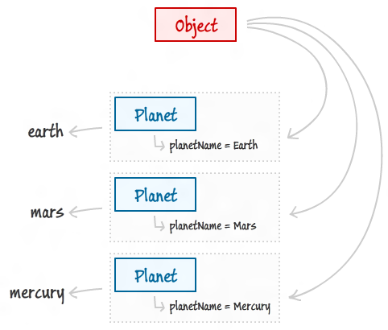

这篇文章是一篇翻译文，当然也结合自己的一些看法和观点。该文的博主是写连续剧的，前面的东西就先按下不表了，直接开始进正题吧。  
一句话很重要，学Js的 Objects 和 Classes 需要通过掌握Js的 `instance variables` , `methods` , `prototypes` 等等，以下用 O 和 C 简称对象和类了。  
[原文链接](http://www.kirupa.com/html5/objects_classes_javascript.htm)

## 引子
作者比较有趣，采用 intergalactic 的思维来展开，首先让我们看下太阳系吧。

DT地普及下行星知识，想要成为一颗行星，需要满足以下标准：

1. 有绕太阳公转的轨道
2. 有足够的质量保持一个稳定的形状
3. 不自发光

黑线，上面好像说的这是一门 astronomy lesson 了，:P，nonono，恰恰是上面三条规则定义了什么东西可以成为一个行星。三条规则其实就是传说中的**定义**，你怎么去定义一个东西，这恰恰是最难的部分。而当我们去判断地球、水星等为什么是行星时，我们则是引用这样的原因：它们绕日公转，有质量，不自发光。这些原因被封装在了我们对于行星的定义里面。  
好，下面，就是见证奇迹的时刻，让我们将上面的例子和Js的O/C联系起来。

- class 就好像我们上面对行星的定义一样，它划出了一系列描述某物的条条框框的标准、规则和特点，就像样板一样
- objects 就是一个个具体的行星了，如地球、水星，金星等，也可以说是 `instances`

具体关系就像下面这张图一样：

## 创建O/C
我们先创建一个 Planet 类好了：

    // 创建一个Js类无非就是一个函数，好听一点就叫它 Mr. Object Constructor
    function Planet(name) {
        this.planetName = name;
    }

其实上面就是一个构造函数，但是在Js中构造函数和普通的functions是没有区别的，更甚者，Js里其实压根是没有一个词叫class的，这只是我们为了和OOP比较好的契合这样叫的。那么怎么通过上面的构造函数创建objects呢？

    // 创建行星实例
    var earth = new Planet('Earth');
    
为什么上面引用是用 this 关键字，相信看了下图，你应该会有直观的想法，每个object都是一个scope：

