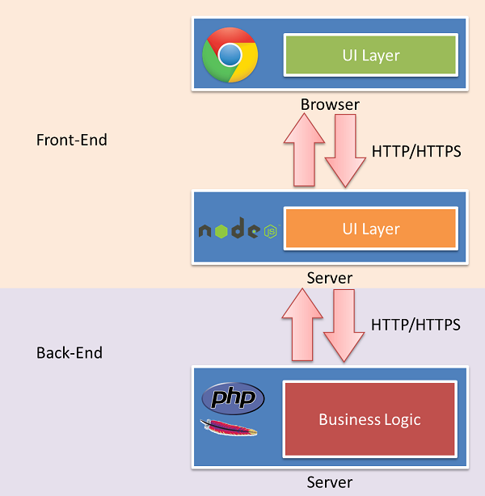

前端工程师可谓有一部辛酸的血泪史呀，被讽不就是个搞UI的么，不就是个切图的么，不就是个做页面的么，诸如此类等等等等，现在，Js大牛 *Nicholas C. Zakas* 出来为我们正名了。其实我想说，我们要为自己正名。   
[Node.js and the new web front-end](http://www.nczonline.net/blog/2013/10/07/node-js-and-the-new-web-front-end/)

## 一个应用，两层UI
让我们来直接看个图，下图说明了传统意义上的应用前后端架构。

在上面的web应用架构图中，我们可以很清晰看到有两层UI，其中在浏览器的UI层就是属于前端的独立领域。后端的UI层则是前后端的交汇处所在。后端（服务器）的其余部分就是整个应用的核心所在：业务逻辑。后端的UI层是很薄的一层。

## Node.js出现后的应用架构
自从09年 Node.js 面世以来，我们看到的前端是不一样的世界了。见下图：

原文中有几句排比句，形象地说明了将这个本来很薄的UI层单独分离出来的反义疑问句，我觉得太经典，不翻译了。

*Do back-end engineers care about how users travel from page to page? Do they care whether or not navigation is done using Ajax or with full page refreshes? Do they care whether you’re using jQuery or YUI? Generally, not at all. What they do care about is that data is stored, retrieved, and manipulated in a safe, consistent way.*

这样，运用 Node.js ，前端后端都可以用这种语言：有了它，前端可以通过Js来写这个剥离出来的UI层，后端则可以用它做一些REST接口，暴露出来给第二层UI使用就可以了。