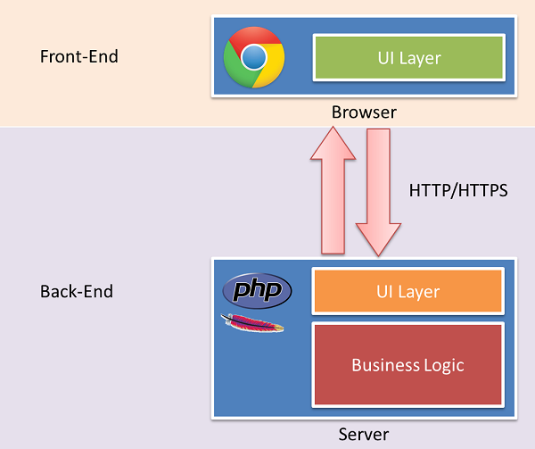

前端工程师可谓有一部辛酸的血泪史呀，被讽不就是个搞UI的么，不就是个切图的么，不就是个做页面的么，诸如此类等等等等，现在，Js大牛 *Nicholas C. Zakas* 出来为我们正名了。其实我想说，我们要为自己正名。   
[Node.js and the new web front-end](http://www.nczonline.net/blog/2013/10/07/node-js-and-the-new-web-front-end/)

## 一个应用，两层UI
让我们来直接看个图，下图说明了传统意义上的应用前后端架构。

在上面的web应用架构图中，我们可以很清晰看到有两层UI，其中在浏览器的UI层就是属于前端的独立领域。后端的UI层则是前后端的交汇处所在。后端（服务器）的其余部分就是整个应用的核心所在：业务逻辑。后端的UI层是很薄的一层。

## Node.js出现后的应用架构
自从09年 Node.js 面世以来，我们看到的web应用开发架构是不一样的世界了。见下图：

我自己对web应用开发三层架构逻辑的理解，以做菜为比喻来形容新的应用架构的三层逻辑：

- backend业务逻辑层：相当于菜品、原料、调味料等的采购，添加，储备，定期更新等，为backend UI层提供原料，以及这些原料是否合格的把关控制，原料的筛选等
- backend UI层：相当于炒菜的环节，需要酱油，就从业务逻辑层拿酱油，**至于菜谱什么，应该怎么炒的逻辑现在还不确定是在这层还是逻辑层，个人觉得应该是在这一层**
- frontend UI层：相当于炒好了放到盘子里的菜，而用户吃菜，酸甜苦辣呀，好吃难吃，就是体验了，而控制这个体验的就是frontend中的JavaScript代码了

那么 Node.js 在这个过程中扮演了什么角色呢？可以这样理解：

- 业务逻辑层：相当于案板，以及上面准备好的各种食材，还有调味料
- Node.js作用1：相当于这两层之间的取食材的东西（勺子）
- backendUI：相当于平底锅，煤气，还有食谱（菜谱）
- Node.js作用2：相当于把炒好的菜放到盘子中去的勺子
- frontendUI：相当于各种好看精致的盘子，来盛上面炒好的各种满含全席，全席中有道菜叫HTML，有道叫CSS，有道叫JS，等等等等，而JS就扮演了客户端（frontend）中特别核心的猴脑那道菜的作用，用户吃的感觉好坏，很大程度靠的是它

原文中有几句排比句，形象地说明了将这个本来很薄的UI层单独分离出来的反义疑问句，我觉得太经典，不翻译了。

*Do back-end engineers care about how users travel from page to page? Do they care whether or not navigation is done using Ajax or with full page refreshes? Do they care whether you’re using jQuery or YUI? Generally, not at all. What they do care about is that data is stored, retrieved, and manipulated in a safe, consistent way.*

这样，运用 Node.js ，前端后端都可以用这种语言：有了它，前端可以通过Js来写这个剥离出来的UI层，后端则可以用它做一些REST接口，暴露出来给第二层UI使用就可以了。

## 引出的问题
我能想到的自己也没有解决的问题目前有：

- web开发中的前后端的区别，按照上面，这个问题应该不难回答

- web开发中前后端的UI层有什么区别？*参照上面的比喻**
    + Front-end UI layer is the delivered HTML, CSS, JavaScript, images, etc.
    + Back-end UI layer is templating, data fetching and cooking, etc. 这一层本身的界面呢？**答案是没有的**，因为这里的层是抽象的概念，并不是说按照界面来分层，是按照功能逻辑来分层的，**这一层可以理解为炒菜的过程，上一层则是最后炒出来的菜，而底层的逻辑则是菜原料的采购，切割等**

- web开发的应用是B/S架构，那桌面应用的C/S架构的前后端又是怎么样的呢？（可以参见WPF）

- web开发需要的服务器有哪些？web服务器（http服务器）、数据库服务器，还有哪些？都有哪些区别呢？
	+ web服务器
	+ 应用服务器
	+ 数据库服务器
	+ 做一个不恰当的比喻：数据库服务器好比是磁盘驱动器，没有了他，没有一个计算机玩得转，但是，直接和他打交道实在是太困难，所以应用程序离不开它，但是没有一个应用程序会直接和他打交道。应用服务器则类似于操作系统内核。他提供了一个统一的和数据库交流的方式，以及其他很多功能。但是操作系统内核的服务对象是操作系统中的其他程序，而不是终端用户。web服务器类似于图形界面程序，比如X11。他提供了一个方便的外部访问方式。
	+ 最简单的布局，是三个东西放在同一台机器上。最安全的方式，是防火墙-〉web服务器群-〉防火墙-〉应用服务器群-〉防火墙-〉数据库服务器群。对于IBM的系统，在第一道防火墙的后面和web服务器群之间，还有reverse proxy，以及network dispatcher，来完成主机名称映射以及load balancing的功能。这个是我见过的最变态的布局了。

- 如果以上的web应用开发架构，加上数据库服务器，那又应该是如何的一个情形呢？

## 相关链接
另外，我是从哪里看到 Zakas 的这篇文章呢，说来也巧，最早是伯乐在线的一篇翻译文，我实在看不下去了，去看英文原文，[Isomorphic Js](http://nerds.airbnb.com/isomorphic-javascript-future-web-apps/) ，这篇是讲同质的Js的，也很棒，我就不翻译了，因为它不是鼻祖，鼻祖在这里[Scaling Isomorphic Javascript Code](http://blog.nodejitsu.com/scaling-isomorphic-javascript-code)，最后就看到现在这篇文章了。