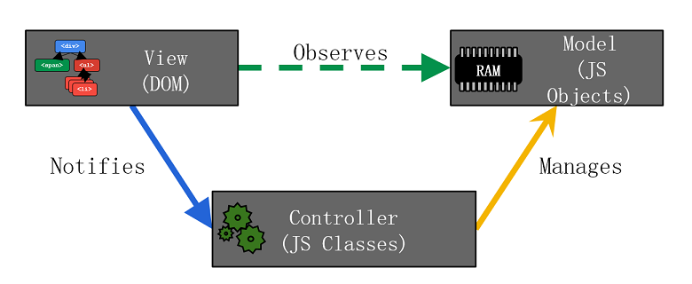

本文主要是根据 ng 书的作者 Brad Green 的演讲PPT学习进行的一个笔记，应该讲是对 ng 的一个概览吧。凑会着看看大家。[PPT地址](http://vdisk.weibo.com/s/zrAFTGAVltFxz?sudaref=weibo.com)

## 用ng构建app：基本概念

### **Setup : Template**

    <html ng-app="coolApp">
    ...
    <body>
    ...
        
        
    </body>
    </html>
    
### **Setup : JS**

    var myApp = angular.module('coolApp', []);
    
## ng开发app遵循的原则
主要有三个原则：

- Structure : MVC
- D.R.Y. : Boilerplate
- Testability

### **原则1：MVC的框架结构**

这其中呢，最重要的就是这个框架的结构了，可以用这条链来形容：*Model -- View -- Contrller* ，请看下面这张图：

从上图可以看出很清晰的关系：

- View：DOM对象，监听Model是否有变化，通知Controller这种变化
- Controller：JS Classes，从View处接收通知，对Model进行操作
- Model：JS Objects，受View的监听，受Controller的控制及操作

上面的Controller和Model对应了JS的两个概念，Classes 和 Objects ，要好好揣摩，具体可以参见：[这篇文章](http://www.kirupa.com/html5/objects_classes_javascript.htm)，另外还可以到stackoverflow上找到很多你要的答案。

下面就来看一个MVC代码片段的例子：

    // Model
    { 'name' : 'Misko' }
    
    // View
    

        Hi, { {person.model.name} }
    

    // Controller
    myApp.controller('PersonCtrl', function() {
        this.model = { name : 'Misko'};
    });

一般情况下，其实 Model 的数据是被注册在 $scope 对象中的，和 Controller 是在同个js文件中的。

### **原则2：消除boilerplate**
在这个原则下，尽可能采用 directives 去写 View ，在markup中可以用到 `{{ }}` 的尽量用，采用一些 filters 和表单验证。

### **原则3：测试**
测试的加入，比如karma，用的是jasmine语法，没有提到。

## ng的特点

### **数据绑定**
让我们看下面的代码：

    // hello.js 中
        this.greeting = 'Hola!';
        
    // hello.html 中
        { {greeter.greeting} }                  // 1-way binding
        <input ng-model="greeter.greeting" />   // 2-way binding
        
**需要注意**的是如果在页面的初次加载中使用绑定，需要避免加载未被css样式渲染的内容，看下面的几个例子：

    // 下面的 markup 表现没有问题，除了第一次加载
        
{ {someObj.sth} }

    // 用 ng-cloak 避免在加载时有些内容不被样式化
        
{ {someObj.sth} }

        
    // 用属性绑定的形式也可以避免上述情况
        

### **Directives**
先来看一下下面的代码片段，很simple的：

    

        
        <button ng-click="cart.delete($index)">Delete</button>
    

上面有三个指令，如果在它们前面都加上前缀 `data-` 的话，这样可以用来做 `directive validation` 验证指令的有效性，当然，一般情况下这是不必要的。

### **依赖注入**
首先是定义一个服务，可以是数据服务，操作服务等等，看一下下面的例子：

    // Definition
    function MyFoo() { ... };
    module.service('foo', MyFoo);
    
    // Usage
    function MyBar(foo) {
        Foo instanceof MyFoo; // true!
    }
    
### **Filters**
比如有ng内置的一些filter，如：

    
{ { invoice.total | currency } }

    
还可以采用自定义filter，如：

    // Definition
    myApp.filter('reverse', function() {
        return function(input) {
            var out = '';
            for (var i=0; i < input.length; i++) {
                out = input.charAt(i) + out;
            }
            return out;
        }
    });
    
    // usage
    
{ { obj.str | reverse } }

    
### **Controllers**
在之前讲结构MVC时讲到了一些这是干嘛的，那现在就要更具体地讲它是怎么发生的。

- View 要监听Model --> 而Model注册在$scope中 --> $scope可以通过controller访问 --> controller可以通过内部定义的函数操作（更新）$scope的model --> 进而改变view
    + 所以就有了controller的第一个功能：将model暴露给View
    + 同时有了第二个功能：更新model进而改变view
    
- 另外一个就是定义在controller中的函数暴露给view中的相关指令进行调用，进而来处理用户交互

- 除了上面几点，还有就是在模版中每次被引用，就会初始化一次

- 最后，上面第一点也提到了，它可以访问到$scope对象

### **$scope**
正如上面一小点所说，$scope可以被controller访问，然后就可以在模版中使用：

    // request $scope in controller
    myApp.controller('GreetCtrl', function($scope) {
        $scope.greeter = { greeting : 'Misko' };
    }
    
    // use in template
    
{ {greeter.greeting} }

    
从上面可以看出它有这样一些特点：

- 是表达式进行计算的上下文，其中表达式包括 `{{}}` 和 `ng-bind`
- 和DOM结构挂钩，也是树级别的
- 基于原型的继承 = 全局读，局部写

$scope有两个重要的方法：

- $watch(expression, callback) : 当$scope监听的表达式发生改变时，callback被调用
- $apply() : 从ng的事件循环机制外进行数据绑定的同步，如：

    $scope.$apply(function() {
        $scope.result = thirdPartyLib.doSth();
    });
    
### **与后台通信**
这里面主要讲两个方法：

- $http : HTTP server communication
- $resource : RESTful server communication
- 其他选项：`Restangular` , `AngularFire` , `BreezeJS`

### **Routes**
通过 `ng-view` 和 `$routeProvider` 的配合达到SPA效果：

- `ng-view` 指令作为 content placeholder
- `$routeProvider` 进行配置