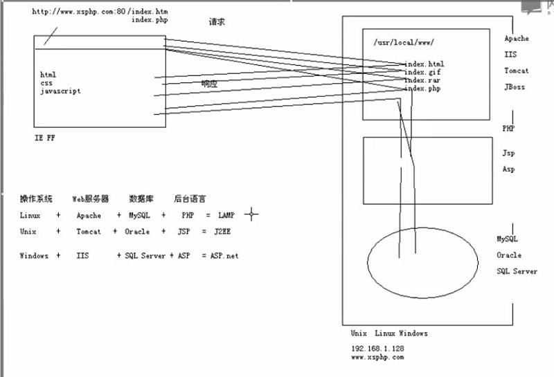

## 以Apache服务器、php为例详解动态网站访问过程

目前来说，网站页面主要分为静态页面和动态页面，纯静态页面组成的网站现在相对比较少见，大型网站一般使用的是动态网站建站技术，还有一部分网站是静态网页与动态网页共存，本文以Apache服务器、php语言为例，详解动态网站的访问过程，下面直接切入本文主题。

### (1) 用户端访问服务器端的html文件

+ **S1：**通过本机配置好的DNS域名服务器地址寻找DNS服务器，将网站URL中的Web主机域名解析为Web服务器所在的Linux操作系统（Apache通常与Linux操作系统组合使用）中对应的IP地址。
+ **S2：**通过HTTP协议（超文本传输协议）去连接上述IP地址的服务器系统，通过默认80端口（默认的端口是80，也有其他端口，输入URL时一般不用输入端口）请求Apache服务器上相应目录下的html文件（如index.htm）。

+ **S3：**Apache服务器收到用户的访问请求后，在它管理的文档目录中找到并打开相应的html文件（如index.htm），将文件内容响应给客户端浏览器（即用户）。

+ **S4：**浏览器收到Web服务器的响应后，接收并下载服务器端的html静态代码，然后浏览器解读代码，最终将网页呈现出来（由于不同的浏览器对于代码的解读规则会不一样，所以不同浏览器对于相同的网页呈现的最终页面效果会有所差异）。

### (2) 用户端访问服务器端的php文件

+ **S1：**该步与上面访问html静态网页是一样的，通过DNS服务器解析出相应的Web服务器的IP地址。

+ **S2：**与上面访问html静态页面相似，不过最后请求的是Apache服务器上相应目录下的php文件，如index.php。

+ **S3：**Apache服务器本身不能处理php动态语言脚本文件，就寻找并委托PHP应用服务器来处理（服务器端事先得安装PHP应用服务器），Apache服务器将用户请求访问的php文件（如index.php）文件交给PHP应用服务器。

+ **S4：**PHP应用服务器接收php文件（如index.php），打开并解释php文件，最终翻译成html静态代码，再将html静态代码交还给Apache服务器，Apache服务器将接收到的html静态代码输出到客户端浏览器（即用户）。

+ **S5：**与上面访问html静态页面相同，浏览器收到Web服务器的响应后，接收并下载服务器端的html静态代码，然后浏览器解读代码，最终将网页呈现出来。

### (3) 用户端访问服务器端的MySQL数据库

如果用户需要对MySQL数据库中的数据进行操作，那么就需要在服务器端安装数据库管理软件MySQL服务器，用来存储和管理网站数据。由于Apache服务器是无法连接和操作MySQL服务器，所以还需要安装php应用服务器，这样Apache服务器就委托php应用服务器去连接和操作数据库，在对数据库中的数据进行管理的时候，一般都需要用到结构化查询语句，即SQL语句。

+ **S1：**该步与上面访问php文件一样，通过DNS服务器解析出相应的Web服务器的IP地址。

+ **S2：**与上面访问php文件一样，请求访问Apache服务器上相应目录下的php文件。

+ **S3：**与上面访问php文件一样，PHP应用服务器接收Apache服务器的委托，收到相应的php文件。

+ **S4：**PHP应用服务器打开php文件，在php文件中通过对数据库连接的代码来连接本机或者网络上其他机器上的MySQL数据库，并在php程序中通过执行标准的SQL查询语句来获取数据库中的数据，再通过PHP应用服务器将数据生成html静态代码。

+ **S5：**浏览器收到Web服务器的响应后，接收并下载服务器端的html静态代码，然后浏览器解读代码，最终将网页呈现出来。

需要注意的是，文中（2）与（3）的区别是，一个访问了数据库，另一个没有访问数据库，所以在过程中有点差别。

